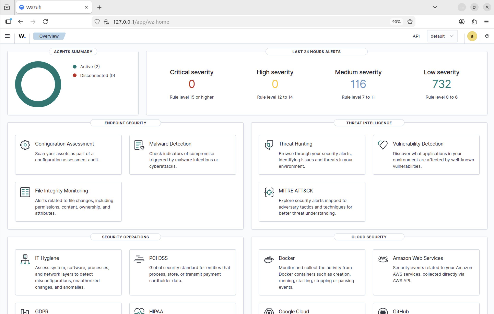
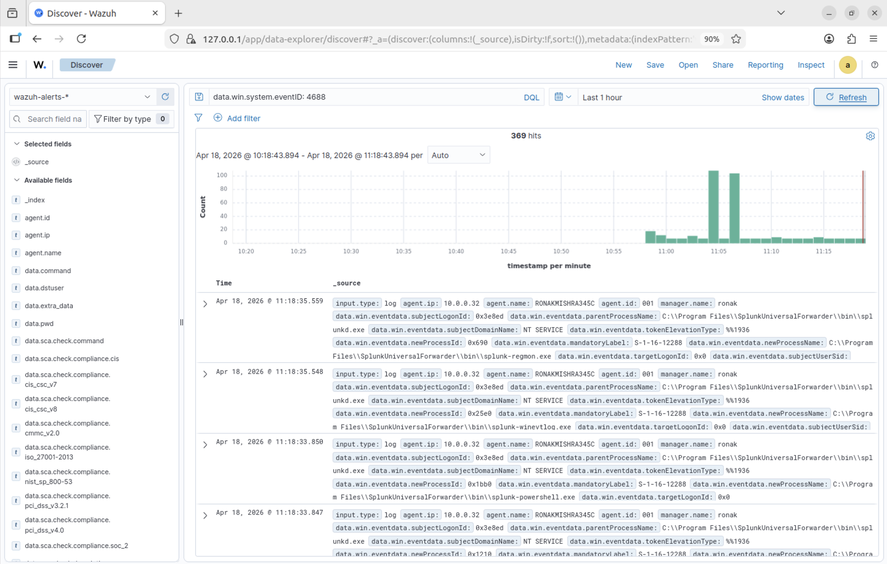
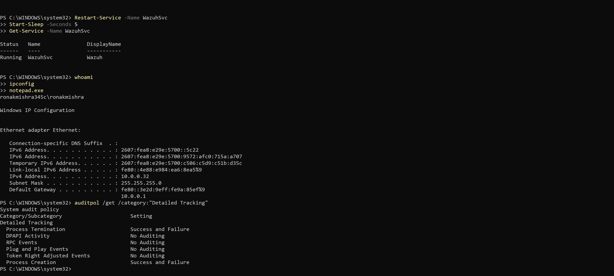
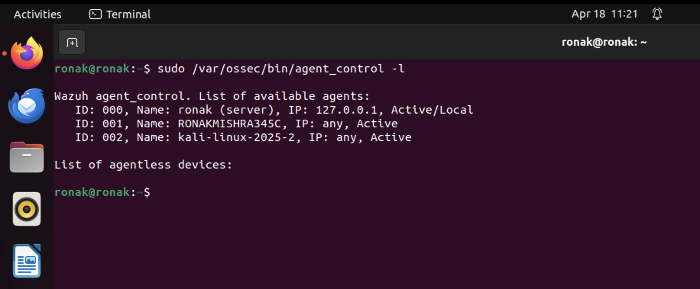
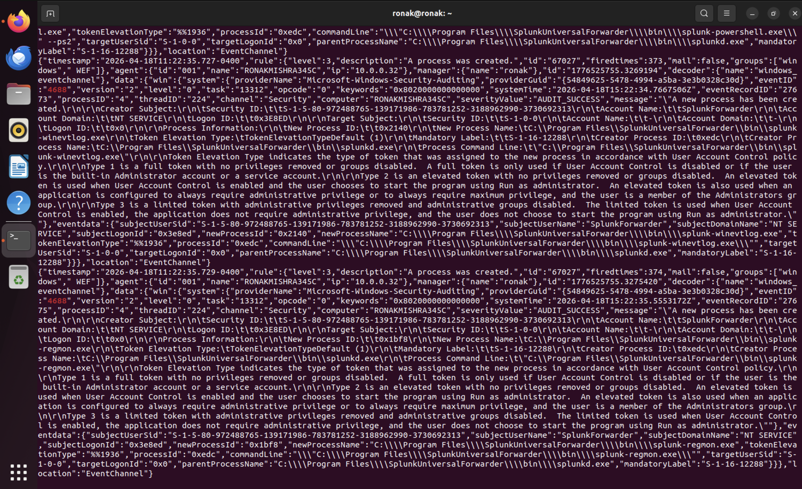
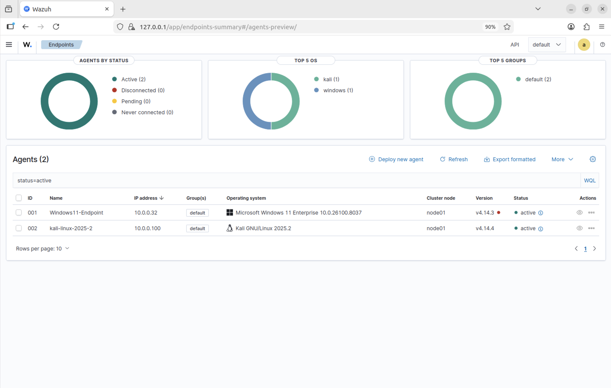

# Day 1 — Wazuh SIEM Lab: Foundation & Stabilization

**Date:** April 18, 2026  
**Duration:** ~3 hours  
**Status:** ✅ Complete

---

## Objective

Build a stable, multi-agent Wazuh SIEM lab from the ground up and verify that real security events are flowing from endpoints to the dashboard. Before writing a single detection rule, the foundation needed to be solid — agents connected, logs flowing, and audit policy configured correctly on Windows.

---

## Lab Environment

| Component | Details |
|-----------|---------|
| Host Machine | MacBook M4 Pro, 24GB RAM |
| Hypervisor | Parallels Desktop |
| Wazuh Manager | Ubuntu 22.04 ARM64 — IP: 10.0.0.33 |
| Agent 001 | Windows 11 Enterprise — IP: 10.0.0.32 |
| Agent 002 | Kali Linux 2025.2 — IP: 10.0.0.100 |
| Wazuh Version | Manager v4.14.4, Win Agent v4.14.3 |
| Network | Parallels Shared Network — 10.0.0.0/24 |

---

## How Wazuh Works — Architecture

Wazuh is a pipeline made up of five components working together:

- **Agent** — Runs on every monitored endpoint. Reads the Windows Event Log, syslog, auth logs. Performs FIM and SCA. Sends everything encrypted to the manager on port 1514.
- **Manager** — The brain. Raw logs arrive and pass through decoders that parse them into structured fields. The rule engine then evaluates those fields and fires alerts with severity levels 0–15.
- **Filebeat** — The connector between manager and indexer. Reads `/var/ossec/logs/alerts/alerts.json` and ships events to the indexer. If Filebeat breaks, the dashboard goes blank even though alerts are still generating.
- **Indexer** — Based on OpenSearch. Stores all alerts and makes them searchable. Runs on port 9200.
- **Dashboard** — Based on OpenSearch Dashboards. Queries the indexer and displays alerts, agent status, MITRE ATT&CK mappings, and compliance scores.

**Data flow end to end:**
```
Event on endpoint → Agent collects → Encrypted to manager (port 1514) → Decoder parses
→ Rule engine evaluates → Alert written to alerts.json → Filebeat ships to indexer
→ Dashboard displays
```

---

## What I Did

### Step 1 — Both Agents Connected and Active



Installed the Wazuh agent on Kali by adding the repository and running:

```bash
WAZUH_MANAGER="10.0.0.33" sudo apt-get install wazuh-agent -y
```

The install succeeded but the service failed to start. Root cause: the `WAZUH_MANAGER` environment variable did not write the IP into `ossec.conf` properly. Fixed with:

```bash
sudo sed -i 's/<address>.*<\/address>/<address>10.0.0.33<\/address>/' /var/ossec/etc/ossec.conf
```

After the fix, both agents showed as Active in the dashboard.

---

### Step 2 — Event ID 4688 Flowing with Command Line



369 process creation events confirmed flowing from the Windows agent. Full command line visible in every event — critical for detection work.

---

### Step 3 — Windows Audit Policy Enabled



The audit policy was entirely disabled by default. Enabled the following via `auditpol`:

```bash
auditpol /set /subcategory:"Process Creation" /success:enable /failure:enable
auditpol /set /subcategory:"Logon" /success:enable /failure:enable
auditpol /set /subcategory:"User Account Management" /success:enable /failure:enable
auditpol /set /subcategory:"Security Group Management" /success:enable /failure:enable
auditpol /set /subcategory:"Sensitive Privilege Use" /success:enable /failure:enable
```

Also enabled command line logging for Event ID 4688:

```bash
reg add "HKLM\SOFTWARE\Microsoft\Windows\CurrentVersion\Policies\System\Audit" /v ProcessCreationIncludeCmdLine_Enabled /t REG_DWORD /d 1 /f
```

> **Key lesson:** Wazuh is a collector, not a generator. If Windows is not logging an event, Wazuh has nothing to collect. The audit policy controls what Windows writes to its Security Event Log.

---

### Step 4 — Manager-Side Agent Confirmation



Manager-side verification via `agent_control` — both agents registered, connected, and Active.

---

### Step 5 — Raw Alert Stream Confirmed



Raw 4688 alerts streaming into `alerts.json` in real time — confirming the full pipeline from endpoint to storage is working.

---

### Step 6 — Dashboard Overview



848 total alerts in 24 hours — the lab is actively generating data across both agents.

---

## Problems & Solutions

| Problem | Root Cause | Fix | Lesson |
|---------|-----------|-----|--------|
| Kali agent failed to start | IP not written to ossec.conf during install | Manual sed command to replace placeholder | Always verify config files after automated installs |
| Windows active but no events | Audit policy completely disabled | Enabled audit policy, restarted agent | Verify at the source before blaming the SIEM |
| ossec.conf edit crashed agent | Added `<agent_name>` tag to already-registered agent | Removed tag, renamed via manager SQLite database | Agent names register at first connection — don't change them post-registration |

---

## Key Concepts Learned

**Wazuh is a Collector, Not a Generator**  
The SIEM can only work with data the OS provides. Endpoint configuration is just as important as SIEM configuration.

**Command Line Logging is Non-Negotiable**  
Event ID 4688 without command line logging tells you a process ran but not what it did. `cmd.exe` running is normal. `cmd.exe` running with a base64-encoded PowerShell payload is not.

**Decoder → Rule Pipeline**  
Raw logs are unstructured text. Decoders parse them into structured fields. Rules evaluate those fields. Without proper decoding, rules cannot match.

---

## What's Coming in Day 2

- Configure PowerShell Script Block Logging (Event ID 4104)
- Enable PowerShell Module Logging (Event ID 4103)
- Explore SCA CIS benchmarks on Kali
- Build baseline understanding of normal activity before writing detection rules
