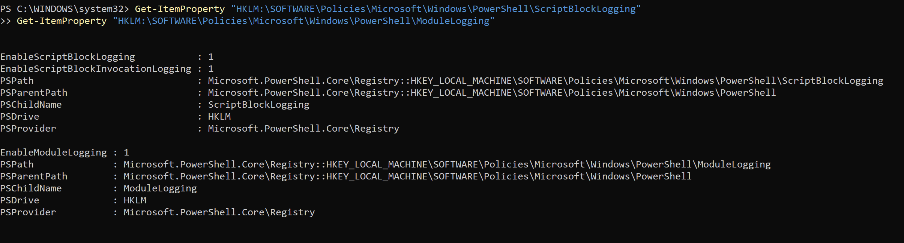
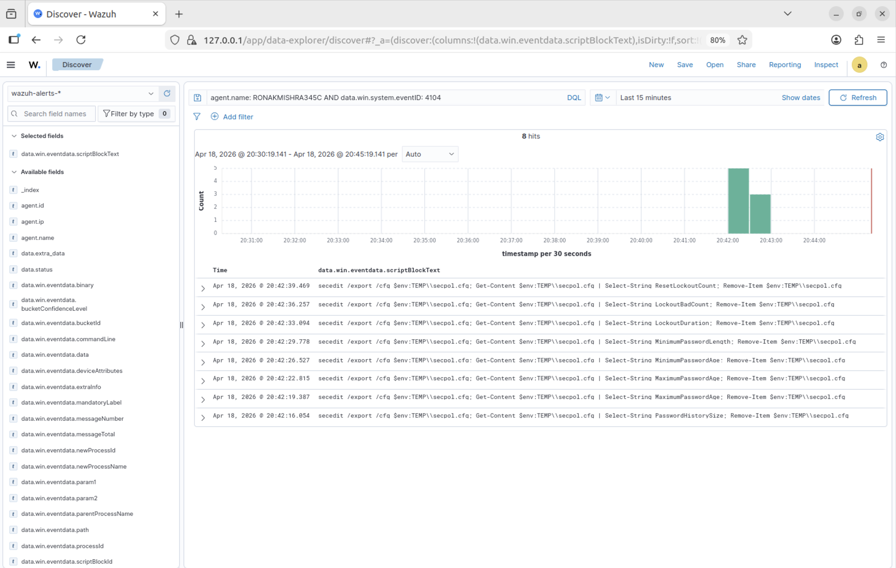
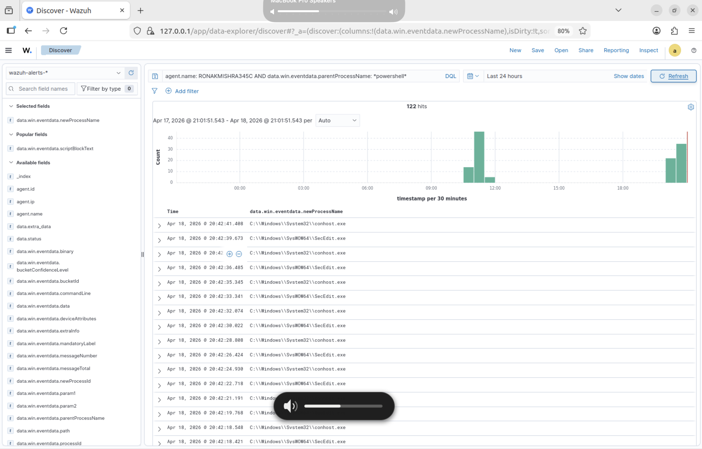
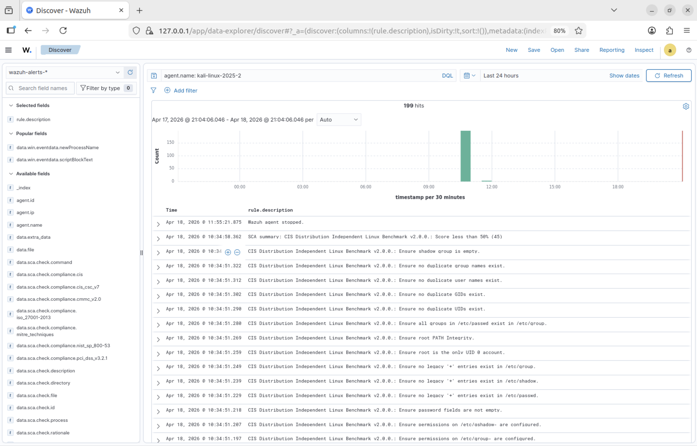

# Day 2 — Log Sources, PowerShell Visibility & Baseline Building

**Date:** April 18, 2026  
**Duration:** ~3 hours  
**Status:** ✅ Complete

---

## Objective

Improve detection visibility on Windows by enabling PowerShell logging, understand what normal activity looks like on both endpoints, and configure Wazuh to collect new log sources.

---

## What I Tried First: Sysmon on ARM64 Windows

Sysmon adds 29 additional event types beyond native Windows logging — per-process network connections, DNS queries, registry changes. Widely used in enterprise SOC environments.

Installation failed:
```
StartService failed for SysmonDrv: This driver has been blocked from loading
```

Root cause: Sysmon uses a kernel-mode driver requiring valid code signature for ARM64 Windows. Running on an M4 Mac in Parallels, ARM64 Windows enforces Secure Boot and driver signature enforcement. Attempting to enable test signing also failed — Parallels does not expose a Secure Boot toggle for Windows 11 ARM64 VMs.

The workaround is using native Windows features that achieve similar visibility without kernel drivers.

---

## PowerShell Script Block Logging

PowerShell Script Block Logging captures the complete content of every PowerShell script that executes — including scripts that were obfuscated or base64-encoded. Windows decodes them before execution, and Event ID 4104 captures the decoded content.

### Why This Matters for Detection

When an attacker uses PowerShell, they almost always obfuscate the payload:
```
powershell -enc SQBuAHYAbwBrAGUALQBXAGUAYgBSAGUAcQB1AGUAcwB0...
```

Without Script Block Logging, you see only the encoded string — unreadable. With it enabled, Event ID 4104 shows the fully decoded script. The obfuscation is completely defeated.

### PowerShell Event IDs

| Event ID | Name | What It Captures |
|----------|------|-----------------|
| 4103 | Module Logging | Every command invocation, pipeline input/output, modules loaded |
| 4104 | Script Block Logging | Complete text of every script block in decoded form |
| 4105 | Invocation Started | Timestamp when script block execution began |
| 4106 | Invocation Completed | Timestamp when script block execution finished |

### Enabling It

```powershell
# Script Block Logging — Event ID 4104
$path = "HKLM:\SOFTWARE\Policies\Microsoft\Windows\PowerShell\ScriptBlockLogging"
New-Item -Path $path -Force
Set-ItemProperty -Path $path -Name "EnableScriptBlockLogging" -Value 1
Set-ItemProperty -Path $path -Name "EnableScriptBlockInvocationLogging" -Value 1

# Module Logging — Event ID 4103
$mpath = "HKLM:\SOFTWARE\Policies\Microsoft\Windows\PowerShell\ModuleLogging"
New-Item -Path $mpath -Force
Set-ItemProperty -Path $mpath -Name "EnableModuleLogging" -Value 1
```

### Registry Keys Confirmed



Registry keys set correctly — Script Block Logging and Module Logging both enabled.

### Adding PowerShell Logs to Wazuh

Added to `ossec.conf` on the Windows agent:

```xml
<localfile>
  <location>Microsoft-Windows-PowerShell/Operational</location>
  <log_format>eventchannel</log_format>
  <query>Event/System[EventID = 4103 or EventID = 4104]</query>
</localfile>

<localfile>
  <location>Windows PowerShell</location>
  <log_format>eventchannel</log_format>
</localfile>
```

### Event ID 4104 Flowing in Wazuh



Event ID 4104 events appearing in Discover within 60 seconds of enabling. The decoded script content is visible directly in the alert — no manual decoding required.

---

## Baseline Building — What Normal Looks Like

Before writing detection rules, you must understand what normal looks like. Spent time in Discover building baselines for both machines.

### Windows Baseline



| Metric | Value |
|--------|-------|
| Total events (last 24 hours) | 815 from Windows agent |
| Rule 67027 firings | 719 — generic process creation (baseline noise level) |
| Normal PowerShell children | conhost.exe, DismHost.exe, csc.exe, SecEdit.exe, whoami.exe, ipconfig.exe, auditpol.exe, Notepad.exe |

Any process spawned by PowerShell that is not on that baseline list is worth investigating. In a real attack, PowerShell spawning `mshta.exe`, `regsvr32.exe`, `certutil.exe`, or `net.exe` would be immediate red flags.

### Kali SCA CIS Benchmark



| Metric | Value |
|--------|-------|
| Total events (last 24 hours) | 199 from Kali agent |
| SCA score | 45% — below 50% threshold (Level 7 alert fired) |
| Why score is low | Kali is a penetration testing distro intentionally configured for offensive work, not hardening |

---

## Key Concepts Learned

**Visibility Requires Two Things Working Together**  
The SIEM collects what the OS exposes. The OS only exposes what you configure it to. Enabling PowerShell logging via registry is what generates 4104 events — without that change, no amount of Wazuh configuration provides PowerShell visibility.

**Script Block Logging Defeats Obfuscation**  
Attackers encode payloads to bypass detection. Windows decodes before executing. Event ID 4104 captures post-decode content. This is why Script Block Logging is one of the first things a security team enables on Windows endpoints.

**Baseline First, Detection Second**  
You cannot write a rule that fires on suspicious PowerShell behavior if you do not know what normal PowerShell behavior looks like. Identifying that conhost, DismHost, csc, and SecEdit are normal children of PowerShell is what makes Day 3 detection rules meaningful.

**The ossec.conf File Controls Everything**  
Every log source requires an explicit `localfile` block in ossec.conf. Nothing is automatic. This prevents agents from flooding the manager with irrelevant data — but it also means missing log sources require manual configuration.
