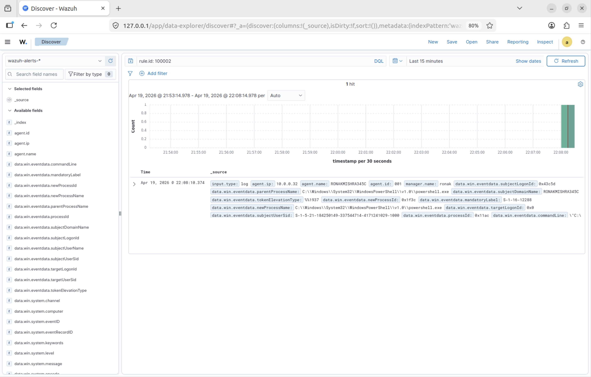
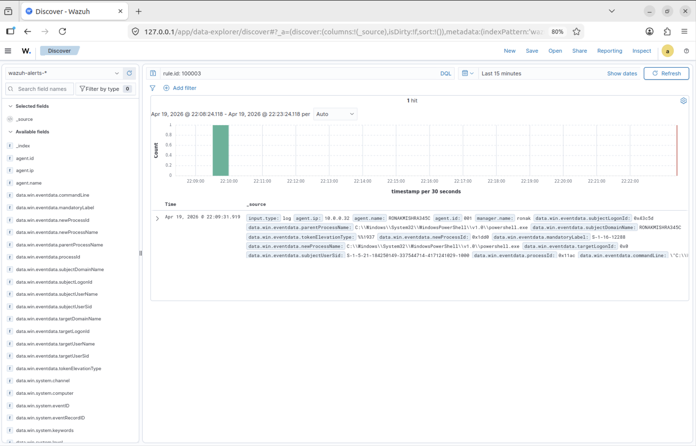
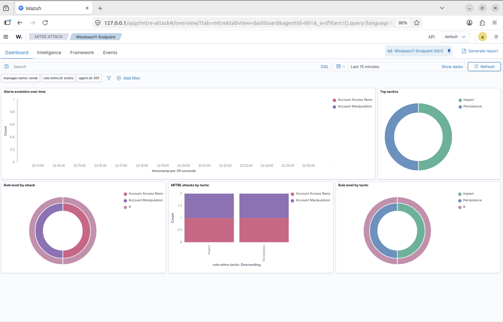

# Day 3 — Detection Engineering: Writing Custom Wazuh Rules

**Date:** April 19, 2026  
**Duration:** ~3 hours  
**Status:** ✅ Complete

---

## Objective

Move from passive monitoring to active detection. Write five custom Wazuh rules that detect real attack techniques, map them to MITRE ATT&CK, verify them against live activity, and understand the detection engineering process end to end.

---

## What is Detection Engineering?

Detection engineering turns noise into signal. Without custom rules, a SIEM fires generic alerts on everything — "a process was created" at level 3, hundreds of times per day. Nobody investigates those.

With good detection engineering, instead of "a process was created" you get "PowerShell ran with an encoded command spawned by a Word document at level 15." That gets investigated immediately.

The difference between a SOC that catches attackers and one that misses them is almost entirely in detection rule quality.

---

## How Wazuh Rules Work

| Component | Purpose |
|-----------|---------|
| Parent rule (if_sid) | Rules are hierarchical. A custom rule only evaluates when its parent fires first. Complex regex only runs on pre-filtered events. |
| Field matching | Rules check specific fields extracted by the decoder. For Windows events: `win.eventdata.FIELDNAME` |
| Description | Human-readable text shown in the dashboard. Must be specific enough that an analyst knows what to investigate. |
| MITRE mapping | Maps the alert to MITRE ATT&CK. Enables the ATT&CK dashboard view. |

### Rule Severity Levels

| Level | Severity | Action |
|-------|----------|--------|
| 3 | Informational | Nobody investigates |
| 7–9 | Medium | Worth reviewing |
| 10–11 | High | Investigate today |
| 12–14 | High | Investigate now |
| 15 | Critical | Drop everything |

---

## Key Debugging Discovery

Rules were not firing even though events were arriving at the manager. Diagnosed by parsing `alerts.json` directly with Python to find exact field names.

**Root cause 1:** Wrong field names. Rules used `data.win.eventdata.commandLine` but the rule engine uses `win.eventdata.commandLine` — without the `data.` prefix.

**Root cause 2:** Wrong parent rule. Used `<if_group>windows</if_group>` instead of the correct `<if_sid>67027</if_sid>`.

> **Lesson:** When rules do not fire, do not guess — read the raw data. grep and Python parsing of alerts.json shows exactly what rule fired and what the field values look like. This is how detection rules are debugged in production too.

---

## The Five Custom Rules

### Rule 100002 — PowerShell Encoded Command (Level 12)



| Attribute | Value |
|-----------|-------|
| MITRE | T1059.001 — Command and Scripting Interpreter: PowerShell |
| Detection | PowerShell execution with `-enc` or `-encodedcommand` flag |
| Parent SID | 67027 (process creation) |
| Regex | `(?i)-enc\|-encodedcommand` |
| Status | ✅ Verified — fired within 30 seconds |

Attackers encode PowerShell payloads in base64 to bypass signature-based detection. Legitimate PowerShell scripts almost never use encoded commands — false positive rate is near zero.

---

### Rule 100005 — New Windows User Account Created (Level 10)


| Attribute | Value |
|-----------|-------|
| MITRE | T1136.001 — Create Local Account |
| Detection | Event ID 4720 — new Windows user account created |
| Parent SID | 60103 (Windows Security events) |
| Status | ✅ Verified — fired immediately, showing username and creator |

Attackers create local accounts for persistent access. If their malware is removed, the backdoor account remains.

---

### Rule 100003 — PowerShell Download Cradle (Level 12)



| Attribute | Value |
|-----------|-------|
| MITRE | T1105 — Ingress Tool Transfer |
| Detection | Invoke-WebRequest, DownloadString, DownloadFile, wget, curl in PowerShell |
| Parent SID | 67027 (process creation) |
| Status | ✅ Verified — fired on Invoke-WebRequest |

Fileless attacks download and execute code directly in memory without writing to disk. Catching the download is often the only opportunity to detect a fileless attack.

---

### Rule 100004 — Office Application Spawning Shell (Level 15 — CRITICAL)

| Attribute | Value |
|-----------|-------|
| MITRE | T1566.001 — Spearphishing Attachment |
| Detection | Word, Excel, PowerPoint, or Outlook spawning cmd.exe, PowerShell, wscript, cscript, or mshta |
| Parent SID | 67027 (process creation) |
| Status | ⏳ Tested in Day 4 |

Legitimate Office applications never spawn command shells under normal circumstances. False positive rate is near zero — level 15 is appropriate.

---

### Rule 100006 — Brute Force Detection (Level 12)

| Attribute | Value |
|-----------|-------|
| MITRE | T1110 — Brute Force |
| Detection | 5+ failed logons (Event ID 4625) from same IP within 120 seconds |
| Correlation | frequency=5, timeframe=120, same_field=win.eventdata.ipAddress |
| Status | ✅ Tested in Day 4 |

Frequency-based correlation — Wazuh counts matching events within the time window and only fires when the threshold is exceeded from ONE source IP.

---

## MITRE ATT&CK Mapping



All 5 rules mapped to MITRE ATT&CK techniques — visible in the Wazuh dashboard ATT&CK view.

---

## Complete Rules File

```xml
<group name="local,windows,custom_detections,">

  <!-- PowerShell Encoded Command — T1059.001 -->
  <rule id="100002" level="12">
    <if_sid>67027</if_sid>
    <field name="win.eventdata.commandLine" type="pcre2">(?i)-enc|-encodedcommand</field>
    <description>ALERT: PowerShell encoded command execution - possible obfuscated attack</description>
    <mitre><id>T1059.001</id></mitre>
    <group>attack,powershell,obfuscation,</group>
  </rule>

  <!-- PowerShell Download Cradle — T1105 -->
  <rule id="100003" level="12">
    <if_sid>67027</if_sid>
    <field name="win.eventdata.commandLine" type="pcre2">(?i)DownloadString|DownloadFile|Invoke-WebRequest|iwr\s|wget\s|curl\s</field>
    <description>ALERT: PowerShell download cradle detected - possible malware download</description>
    <mitre><id>T1105</id></mitre>
    <group>attack,powershell,download,</group>
  </rule>

  <!-- Office App Spawning Shell — T1566.001 -->
  <rule id="100004" level="15">
    <if_sid>67027</if_sid>
    <field name="win.eventdata.parentProcessName" type="pcre2">(?i)winword\.exe|excel\.exe|powerpnt\.exe|outlook\.exe</field>
    <field name="win.eventdata.newProcessName" type="pcre2">(?i)cmd\.exe|powershell\.exe|wscript\.exe|cscript\.exe|mshta\.exe</field>
    <description>CRITICAL: Office application spawned shell process - macro attack likely</description>
    <mitre><id>T1566.001</id></mitre>
    <group>attack,macro,office,critical,</group>
  </rule>

  <!-- New User Account Created — T1136.001 -->
  <rule id="100005" level="10">
    <if_sid>60103</if_sid>
    <field name="win.system.eventID">4720</field>
    <description>ALERT: New Windows user account created - verify if authorized</description>
    <mitre><id>T1136.001</id></mitre>
    <group>attack,persistence,account_creation,</group>
  </rule>

  <!-- Brute Force Detection — T1110 -->
  <rule id="100006" level="12" frequency="5" timeframe="120">
    <if_matched_sid>60122</if_matched_sid>
    <same_field>win.eventdata.ipAddress</same_field>
    <description>ALERT: Multiple failed Windows logons from same IP - possible brute force</description>
    <mitre><id>T1110</id></mitre>
    <group>attack,brute_force,authentication,</group>
  </rule>

</group>
```

---

## Key Concepts Learned

**Detection Rules Need Correct Parent SIDs**  
Rules are hierarchical. Getting the parent wrong means the rule never evaluates. Always verify parent rule IDs by checking the Wazuh ruleset.

**Field Name Format Matters Exactly**  
`data.win.eventdata.commandLine` is the Discover field name. `win.eventdata.commandLine` is the rule field name. Wrong format means the rule never matches.

**Debug With Data, Not Assumptions**  
When rules do not fire, read `alerts.json` directly. Python parsing gives exact field values and which rules fired.

**MITRE ATT&CK is Your Detection Roadmap**  
Every technique has documented artifacts. T1059.001 tells you PowerShell leaves process creation events. T1110 tells you brute force leaves failed logon events. Use MITRE to know what to detect before writing a single rule.
