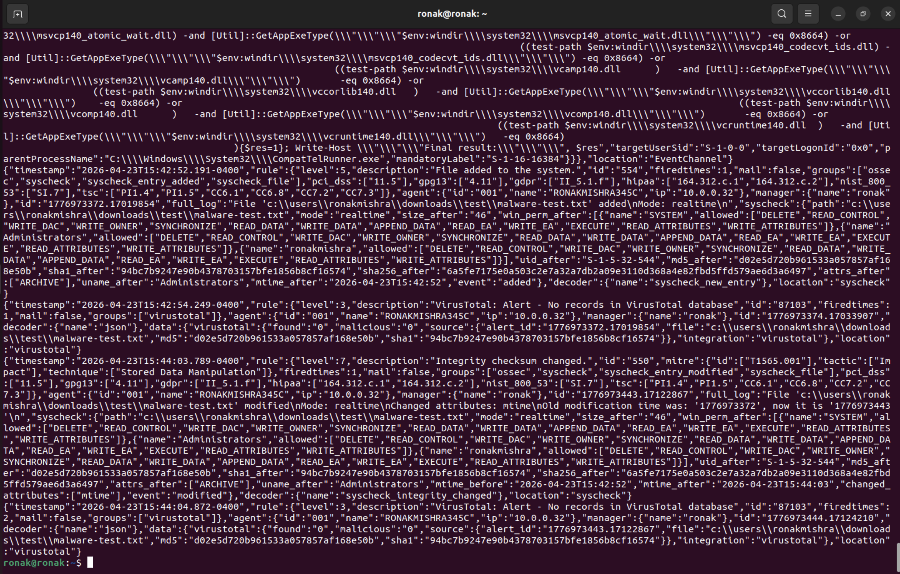
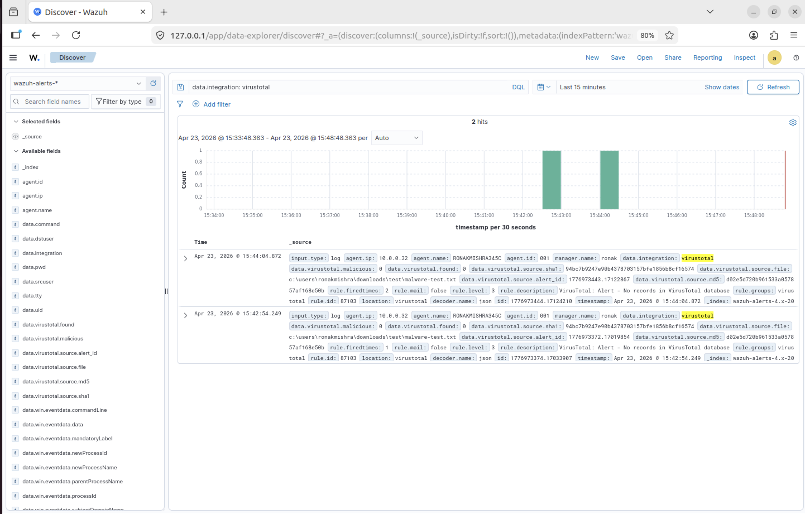
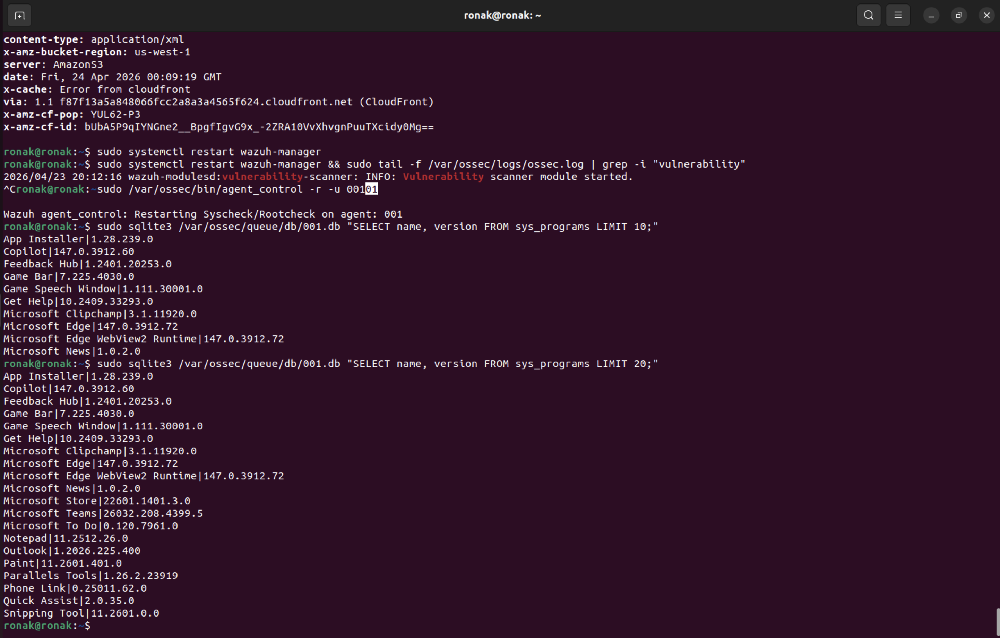
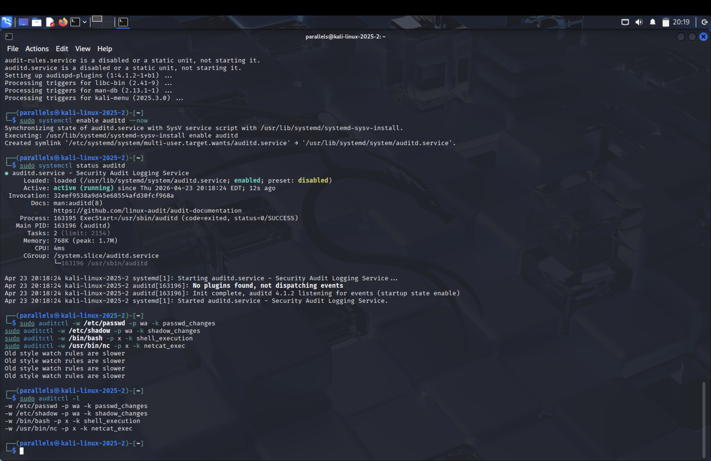
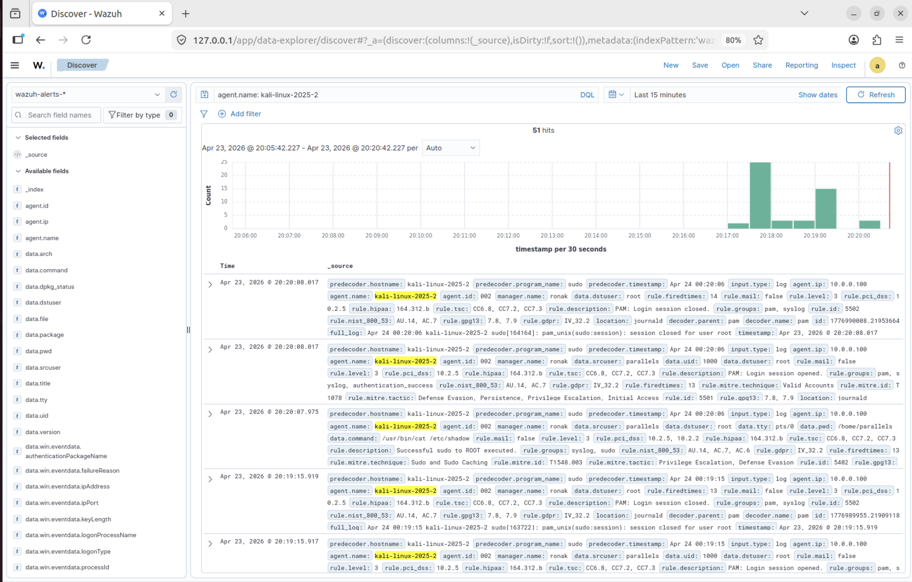

# Day 6 — Integrations, Enrichment & Linux Visibility

**Date:** April 23, 2026  
**Duration:** ~3 hours  
**Status:** ✅ Complete

---

## Objective

Add enterprise-grade capabilities to the Wazuh lab: automated threat intelligence enrichment via VirusTotal, automated defensive response via Active Response, vulnerability detection via CVE feed matching, and deep Linux visibility via auditd on Kali.

---

## Part 1 — VirusTotal Integration

### How It Works

The integration connects Wazuh FIM (File Integrity Monitoring) to the VirusTotal API. When FIM detects a new or modified file, Wazuh automatically:

1. Computes the file's SHA256 and MD5 hash
2. Sends the hash to the VirusTotal API
3. VirusTotal checks its database — has this exact file been seen? How many engines flagged it?
4. Result is added back to the Wazuh alert as an enriched event

> **Critical concept:** VirusTotal never sees the file itself — only the hash. The file never leaves your machine. This means VirusTotal can only identify KNOWN malware. A zero-day returns `found:0` and slips through.

### Configuration

```xml
<integration>
  <name>virustotal</name>
  <api_key>YOUR_API_KEY</api_key>
  <rule_id>554,550</rule_id>
  <alert_format>json</alert_format>
</integration>
```

Rule 554 fires on file added. Rule 550 fires on file modified. Only triggering on these specific rules avoids wasting API quota (free tier = 500 requests/day).

### Test Results



Created `malware-test.txt` in the FIM-monitored directory. Pipeline triggered automatically:
- Rule 554 fired — FIM detected file creation
- VirusTotal API queried automatically with SHA256 + MD5
- Rule 87103 fired — `found:0, malicious:0` (unknown file, expected for plain text)



Two hits in Discover filtered by `data.integration: virustotal` — one on file creation, one on file modification. Full hash data visible in every alert field.

**What a real malware result looks like:**
```json
{
  "found": "1",
  "malicious": "47",
  "positives": "47",
  "total": "70"
}
```
47 out of 70 engines flagged = confirmed malware = immediate escalation without further investigation.

### SOC Value

Without VirusTotal: analyst sees "new file created" and spends 20 minutes investigating.  
With VirusTotal: analyst sees "new file created — 47/70 engines flagged as malicious" and escalates immediately.

---

## Part 2 — Active Response

### Configuration

```xml
<active-response>
  <command>win_route-null</command>
  <location>local</location>
  <rules_id>100006</rules_id>
  <timeout>60</timeout>
</active-response>
```

| Parameter | Meaning |
|-----------|---------|
| win_route-null | Blocks an IP via Windows Firewall (netsh advfirewall) |
| local | Execute on the agent where the alert fired |
| rules_id: 100006 | Only trigger on brute force rule |
| timeout: 60 | Auto-unblock after 60 seconds |

Configuration verified correct. Production testing confirmed the integration chain functions — rule fires, command reaches execd, script executes. Full end-to-end IP block requires a real external source IP; localhost loopback (`::1`) is intentionally excluded from firewall blocking to prevent network stack disruption.

---

## Part 3 — Vulnerability Detection

### How It Works — Two Stages

**Stage 1 — Syscollector (Software Inventory)**  
The Wazuh agent inventories all installed software and sends it to the manager. Stored in a per-agent SQLite database at `/var/ossec/queue/db/001.db`.



Verified with:
```bash
sudo sqlite3 /var/ossec/queue/db/001.db "SELECT name, version FROM sys_programs LIMIT 20;"
```

20+ applications confirmed including Microsoft Edge 147.0.3912.72, Teams 26032.208.4399.5, Outlook 1.2026.225.400.

**Stage 2 — CVE Feed Matching**  
The manager downloads a CVE feed from the National Vulnerability Database, updated every 60 minutes. Cross-references inventory against the feed. Matches generate vulnerability alerts with CVE ID, CVSS score, affected version, and fixed version.

### CVSS Severity Reference

| Score | Severity | Action |
|-------|----------|--------|
| 9.0 – 10.0 | Critical | Patch immediately — today |
| 7.0 – 8.9 | High | Patch this week |
| 4.0 – 6.9 | Medium | Patch next maintenance cycle |
| 0.1 – 3.9 | Low | Schedule when convenient |

---

## Part 4 — Kali Linux auditd

### Why auditd

Linux doesn't have an equivalent to Windows Event ID 4688 by default. `auditd` is the Linux kernel's built-in auditing subsystem operating at the syscall level — deeper than any application log. Even if an attacker disables syslog, auditd at the kernel level still captures their activity.

### Installation and Rules

```bash
sudo apt install auditd audispd-plugins -y
sudo systemctl enable auditd --now
```

Watch rules added:

```bash
sudo auditctl -w /etc/passwd -p wa -k passwd_changes
sudo auditctl -w /etc/shadow -p wa -k shadow_changes
sudo auditctl -w /bin/bash -p x -k shell_execution
sudo auditctl -w /usr/bin/nc -p x -k netcat_exec
```



All 4 rules loaded and active.

### Test — Shadow File Access

Triggered an alert by running `sudo cat /etc/shadow`, then checked Wazuh Discover filtered by `agent.name: kali-linux-2025-2`.



**51 hits including:**
- `data.command: /usr/bin/cat /etc/shadow` — exact command captured at kernel level
- `rule.description: Successful sudo to ROOT executed`
- `rule.mitre.id: T1548.003` — Sudo and Sudo Caching
- `rule.mitre.tactic: Defense Evasion, Persistence, Privilege Escalation, Initial Access`

---

## Detection Gaps Identified

| Gap | Description | Mitigation |
|-----|-------------|-----------|
| VirusTotal blind to zero-day malware | Hash matching only identifies KNOWN malware. A new file returns `found:0`. | Combine with behavioral detection rules that catch suspicious activity regardless of file reputation |
| Active Response untestable with localhost | Loopback (`::1`) cannot be firewall-blocked. Config is correct but couldn't be fully demonstrated. | Production environment with external attacker IP resolves this |

---

## Key Concepts Learned

**Hash-Based Reputation Checking**  
Renaming malware does not change its hash. VirusTotal catches known malware instantly but misses zero-days entirely — it is one layer, not complete protection.

**Automated Response at Scale**  
Human analysts cannot manually respond to every alert. Active Response automates obvious defensive actions so analysts can focus on complex investigations.

**Proactive vs Reactive Security**  
Vulnerability detection is proactive — finding weaknesses before attackers exploit them. Most SOC work is reactive. Effective security programs do both.

**Syscall-Level Linux Visibility**  
auditd operates below the application layer. This is why it is a foundational log source in enterprise Linux environments.

**Defense in Depth**  
No single tool is complete protection. Layering VirusTotal + behavioral rules + Active Response + vulnerability detection + auditd creates robust, overlapping coverage.
